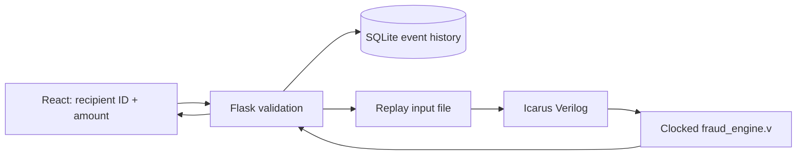

# FraudShield Assignment Report

## Problem statement

Demonstrate how digital logic can classify simulated digital payment events while keeping the decision-making logic in Verilog HDL.

## Objectives

- Accept only a recipient ID and transaction amount in the user interface.
- Store a consistent local event history in SQLite.
- Replay history through sequential Verilog logic on every analysis.
- Detect repeated payments, rapid attempts, a simulated watchlist match, and controlled repeated failures.
- Integrate Verilog with Flask and React without duplicating the final decision in software.

## System architecture



Flask derives a numeric code from the recipient ID only for transport. The watchlist comparison and all pattern calculations happen in `fraud_engine.v`. The engine is reset and replays the complete ordered history for every new request, making behavior deterministic across restarts.

## Verilog module explanation

`fraud_engine.v` contains configurable parameters for the amount threshold, repeated-payment threshold/window, rapid-attempt threshold/window, failure threshold, and two watchlist codes. Sequential logic stores the previous recipient/time and counters. Combinational logic applies the priority order and produces a two-bit decision plus a reason code.

Encoding: `00` ALLOW, `01` VERIFY, `10` FLAG.

| Priority | Verilog condition | Result |
|---|---|---|
| 1 | Watchlist match, three rapid changing-recipient attempts, or three consecutive failed events | FLAG (`10`) |
| 2 | Amount >= ₹5,000 or three same-recipient payments in 300 seconds | VERIFY (`01`) |
| 3 | No rule | ALLOW (`00`) |

## Required scenario validation

`scenario_testbench.v` executes and compares actual engine output for ordinary payment, ₹5,000 amount, repeated recipient, rapid events, watchlist recipient, repeated failures, and an unrelated-history case. Run it with:

```powershell
cd backend
iverilog -o build\scenario_testbench.vvp fraud_engine.v scenario_testbench.v
vvp build\scenario_testbench.vvp
```

The testbench prints actual decision and reason codes for each scenario and a total summary. Do not claim a passing result until the local command has produced the expected summary.

## Frontend and backend integration

The React form has two fields and one action. Flask validates the request, loads SQLite events, writes a replay stream, and invokes `vvp`. The result section displays the parsed decision and reason returned by Verilog. A simulator error is shown to the user and prevents persistence.

## Requirements and limitations

Required software is Windows, Python 3.11+, Flask, Node.js/npm, React, Icarus Verilog, and SQLite. No physical hardware or external payment system is required. Recipient IDs are simulated. Watchlist IDs are examples, not real intelligence. Failure events are controlled educational inputs in the Verilog scenario testbench, not real bank failure detection. FLAG means review, not proof of fraud.

## Screenshots

Capture the minimal application before submitting a transaction, after an ALLOW result, after a ₹5,000 VERIFY result, and after using `watchlist-13` to produce FLAG. Include a terminal screenshot of the actual scenario testbench summary after installing Icarus Verilog.

## Conclusion

FraudShield demonstrates a hardware/software boundary suitable for a beginner assignment: React collects input, Flask validates and persists events, and Verilog performs stateful pattern detection and final classification.
